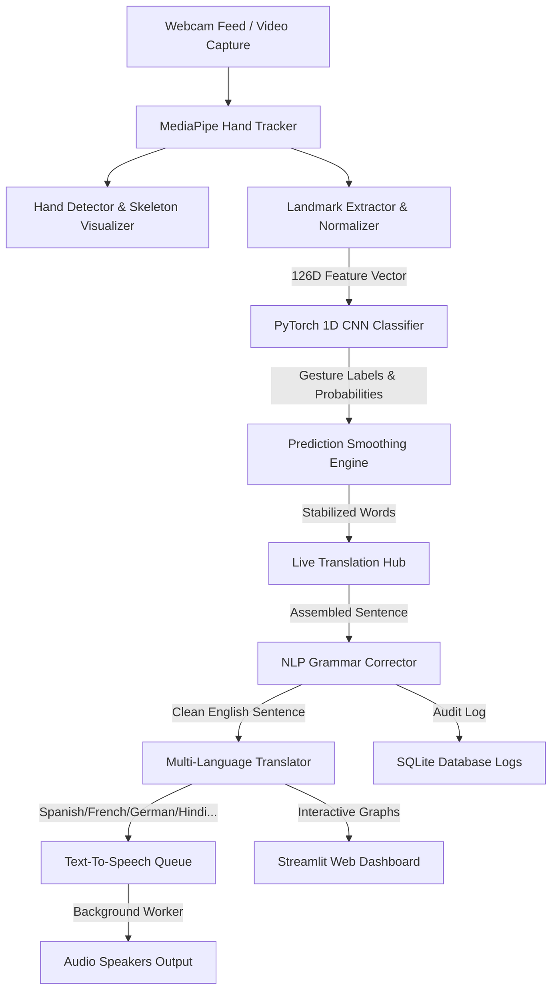

# SIGNVERSE AI 🤟
> **Breaking Communication Barriers Through Artificial Intelligence**
> *A Real-Time Sign Language Recognition & Translation Assistant Platform*

---

## 🌟 Project Vision

**SIGNVERSE AI** is a production-grade, assistive technology platform designed to bridge the communication gap between the deaf/mute community and the hearing world. Using computer vision, PyTorch deep learning, and advanced signal processing, SIGNVERSE AI captures web-camera video feeds, extracts hand skeleton landmarks, and translates sign gestures into:
* **Synthesized Text** (with grammar correction)
* **Asynchronous Speech Vocalization** (multi-speaker & multi-lingual)
* **Live Closed Subtitles**
* **Persistent Conversation History** (for audits, medical records, or transcripts)

This system is built from the ground up to operate with low latency on standard consumer hardware, providing a functional healthcare or daily assistive bridge.

---

## 🏗️ System Architecture



---

## 🛠️ Technology Stack

* **Core Language:** Python 3.8+
* **Deep Learning Framework:** PyTorch
* **Computer Vision:** MediaPipe Hands, OpenCV
* **Data Processing:** NumPy, Pandas, Scikit-Learn
* **Speech Synthesis:** gTTS (Google Speech), pyttsx3 (Offline local TTS)
* **Database & Audits:** SQLite3
* **Analytics & Plots:** Matplotlib, Seaborn
* **Interface & WebApp:** Streamlit
* **Deployment:** Docker

---

## 📂 Project Structure

```
SIGNVERSE_AI/
│
├── datasets/                 # Training datasets and class mappings (.npz, .json)
├── models/                   # Saved PyTorch CNN checkpoints and metadata (.pth)
├── training/
│   ├── train.py              # PyTorch model training pipeline
│   ├── evaluate.py           # Test set evaluation and confusion matrix generator
│   └── dataset_loader.py     # Custom Dataset, DataLoader, and Synthetic Generator
│
├── vision/
│   ├── hand_detector.py      # MediaPipe Hand tracker and custom neon overlays
│   ├── gesture_tracker.py    # Temporal motion buffers and velocity metrics
│   └── landmark_extractor.py # Wrist translation and bounding-box normalizers
│
├── recognition/
│   ├── cnn_model.py          # PyTorch 1D CNN Model Class
│   ├── inference.py          # Real-time predictor and mock-fallback wrappers
│   └── prediction_engine.py  # Modal smoothing voting, SOS flag, and debounce lock
│
├── speech/
│   ├── text_to_speech.py     # Hybrid local/online TTS synthesizer
│   └── speech_generator.py   # Asynchronous thread-safe speaker queue worker
│
├── dashboard/
│   └── streamlit_dashboard.py# Streamlit Web Dashboard (live feed, logs, charts)
│
├── analytics/
│   ├── reports.py            # SQLite database log aggregations
│   └── visualizations.py     # High-resolution frequency, confidence, and trend plots
│
├── database/
│   └── database_manager.py   # SQLite database schema and I/O query manager
│
├── realtime/
│   ├── webcam_app.py         # Standalone desktop OpenCV camera client
│   └── live_translation.py   # Rule-based NLP translator & dictionary database
│
├── requirements.txt          # Production dependencies
├── Dockerfile                # Multi-stage container setup
├── main.py                   # Master entrypoint command-line interface
└── README.md                 # Product documentation
```

---

## ⚡ Quick Start

### 1. Installation
Clone this repository and install the dependencies in a virtual environment:

```bash
# Create virtual environment
python3 -m venv venv
source venv/bin/activate

# Install requirements
pip install -r requirements.txt
```

### 2. Generate Dataset
If you are running from a fresh clone without pre-collected landmark datasets, run the high-fidelity Synthetic Landmark Generator:

```bash
python main.py generate-data
```
*This generates 150 variations per class for 49 gestures (A-Z, 0-9, and phrases like HELLO, HELP, EMERGENCY, WATER, DOCTOR) including random Gaussian noise, scaling, translations, and rotation offsets.*

### 3. Train the Model
Execute the PyTorch training pipeline:

```bash
python main.py train --epochs 15 --batch_size 64 --lr 0.001
```
*This runs training with validation loss evaluation. If the validation loss does not improve for 7 consecutive epochs, early stopping triggers and saves the best model checkpoint to `models/best_sign_model.pth`.*

### 4. Evaluate and Plot Charts
Evaluate model accuracy and generate a confusion matrix:

```bash
python main.py evaluate
```
*This outputs test-set accuracy, precision, recall, F1 metrics, and saves a high-resolution confusion matrix heatmap to `reports/confusion_matrix.png`.*

### 5. Launch the Web Dashboard
Launch the modern, dark-themed Streamlit control panel:

```bash
python main.py dashboard
```
*Access the UI at `http://localhost:8501` to view live translations, run gesture simulations, manage SQLite logs, view analytics charts, and test the SOS alert panel.*

### 6. Launch the Standalone Desktop Client
For high-performance, low-overhead native window execution:

```bash
python main.py webcam
```

---

## 🧠 Deep Learning & Vision Pipeline

### 1. Hand Landmark Extraction & Normalization
Standard MediaPipe coordinate structures vary depending on how far the user's hand is from the lens. We resolve this by applying two geometric normalizations:
1. **Translation Invariance:** We subtract the wrist coordinate (Landmark 0) from all other 20 points, placing the wrist origin at `(0, 0, 0)`.
2. **Scale Invariance:** We find the maximum Euclidean distance from the wrist to any knuckle and divide all points by this distance. This ensures that scaling (getting closer or farther from the camera) does not alter the feature vector.
3. Left and right hands are concatenated into a **126-dimensional flat feature vector**. Missing hands are padded with zeros.

### 2. 1D CNN Architecture
We utilize a 1D Convolutional Neural Network in PyTorch. The 126 coordinate elements are reshaped to `(Batch, Channel=1, Length=126)` and passed through:
* **Conv1D (32 channels, kernel 5)** + **BatchNorm** + **ReLU** + **MaxPool1D** (shrinks length to 63)
* **Conv1D (64 channels, kernel 5)** + **BatchNorm** + **ReLU** + **MaxPool1D** (shrinks length to 31)
* **Conv1D (128 channels, kernel 3)** + **BatchNorm** + **ReLU** + **MaxPool1D** (shrinks length to 15)
* **Fully Connected Layer (1920 -> 256)** + **ReLU** + **Dropout (40%)**
* **Linear Classifier (256 -> 49 Classes)**

---

## 🎙️ Speech & Translation Hub

* **Prediction Smoothing:** The raw neural network updates frames at 30 FPS. To filter out noise, a **Sliding Window Mode-Voting Engine** requires a gesture to represent at least **60%** of the last 12 frames, with an average confidence of **70%**, before stabilizing.
* **Debouncing Hand Absence:** To prevent duplicate prints (e.g. printing "HELLO HELLO HELLO"), the system locks the word until the hand is removed from the screen (no hand detected for 12 consecutive frames) or a new hand gesture is made.
* **Rule-based NLP Correcting:** Combines raw gesture tokens (e.g. `["HELP", "DOCTOR"]`) into proper medical grammar templates (`"Help me! I need a doctor immediately."`).
* **Multi-lingual Translator:** Instant translations into **Spanish, French, German, Hindi, Marathi, Arabic, and Japanese** using high-speed dictionary mapping database.

---

## 🚨 Emergency SOS Mode

Designed specifically for clinical and hospital environments, SIGNVERSE AI implements a high-priority emergency handler:
1. When gestures like `HELP`, `EMERGENCY`, `PAIN`, `AMBULANCE`, or `DOCTOR` are detected, the system triggers the SOS protocol.
2. In the **Streamlit Web Portal**, a flashing red visual alert card activates immediately.
3. An **asynchronous voice siren** repeats the alert through local speakers.
4. An emergency event is committed to the SQLite database with high-priority tags for nurse tracking.

---

## 📊 SQLite Schema Details

The persistent database `database/signverse.db` handles the following tables:
* `users`: Stores user profile names, default target translation language, voice settings, and styling choices.
* `translation_history`: Saves conversational logs, including raw English text, translated output, confidence scores, and SOS binary flags.
* `session_history`: Records session durations, total signs transcribed, and average accuracies.
* `gesture_stats`: Tracks usage metrics per gesture for visual analytics.

---

## 🐳 Docker Deployment

To package the application for cloud hosting (AWS, Streamlit Cloud, Azure) or local sandbox execution, build and run the Docker image:

```bash
# Build the Docker image
docker build -t signverse-ai .

# Run the container (Map Streamlit port 8501)
docker run -p 8501:8501 --device=/dev/video0:/dev/video0 signverse-ai
```
*(Note: `--device` mapping is needed for webcam capture inside the container on Linux. For cloud/headless testing, use the Simulated Controller inside the Streamlit dashboard).*

---

## 🎙️ INTERVIEW TALKING POINTS
*Be fully prepared to discuss these design and architecture questions in interviews:*

### 1. Why was a CNN chosen over RNNs/LSTMs?
CNN models are highly effective at capturing local spatial relationships. In this project, the 126 coordinate elements represent adjacent finger joints (e.g. index base, mid, and tip coordinates lie next to each other in the vector). A Conv1D filter slides across these joints, aggregating coordinate combinations (like a finger being bent or extended) as shift-invariant features. Additionally, standard feedforward CNNs have significantly fewer parameters, exhibit no vanishing gradient issues, and achieve much lower inference latency than RNN/LSTM networks, which is crucial for real-time 30 FPS applications.

### 2. Why MediaPipe instead of raw frame CNN?
Training a raw CNN on raw RGB video frames requires massive datasets, is highly sensitive to background lighting, skin tones, and environment clutter, and demands a GPU for real-time execution. MediaPipe abstracts raw pixels into abstract 3D hand coordinates. By using MediaPipe landmarks, we reduce the input size from a `224x224x3` image (150,000+ dimensions) to a compact `126` dimension vector. This allows the neural network to be extremely lightweight, reduces training times from days to minutes, and runs at 30+ FPS on ordinary mobile/desktop CPUs.

### 3. How does Landmark Detection and Normalization work?
MediaPipe Hands detects a hand and outputs 21 landmarks (x, y, z). To make this training robust against camera distance and hand positions, we apply **translation normalization** (subtracting the wrist x, y, z from all coordinates so the wrist sits at `0,0,0`) and **scale normalization** (dividing all coordinates by the maximum wrist-to-joint distance). This yields uniform features regardless of where the hand is in the frame.

### 4. What is the Feature Extraction Process?
For each frame, the landmarks of the Left hand (21 points * 3 coordinates = 63 features) and Right hand (63 features) are extracted. If only one hand is visible, the other hand's 63 slots are padded with zeros. This combined 126-dimensional vector forms the input feature vector.

### 5. What does the Training Pipeline consist of?
The training pipeline consists of:
* Data Loader with stratifying train/val/test splits to handle class balance.
* Adam optimizer with weight decay to prevent overfitting.
* `ReduceLROnPlateau` scheduler to decrease learning rate when validation loss stalls.
* Early stopping based on validation loss to prevent overfitting.
* TensorBoard metrics logging.

### 6. How is Real-Time Inference Optimized?
* **Coordinate compression:** Only 126 floats are passed to PyTorch.
* **CPU Inference:** We execute model inference in `torch.no_grad()` blocks.
* **Threading:** Speech synthesis (which can block python's GIL due to I/O) is offloaded to a background thread queue, preventing webcam UI stutter.

### 7. What strategies improve accuracy?
* **Synthetic data augmentation:** Injecting Gaussian noise, coordinate scaling, and spatial shifts during training.
* **Prediction Smoothing:** Using modal voting (majority rule) over 12 frames prevents frame flicker.
* **Confidence Gating:** Rejecting predictions under 70% confidence.

### 8. What challenges were faced?
* **Flickering hand states:** Addressed by the Prediction Engine's sliding window voting.
* **Repeat signing of the same gesture:** Resolved using a hand-absence (hands-down) state debouncer.
* **Mac/OS audio locks:** Resolved by creating a hybrid speech queue using pyttsx3 offline and gTTS online file fallback.

### 9. What are the scalability opportunities?
* Integrating a sequence-to-sequence Transformer (like T5) trained on Sign Language Glosses to improve NLP grammar translations for complex sign combinations.
* Expanding the dataset to support dynamic gesture trajectory tracking using 3D ConvND or LSTMs over temporal tracking buffers.

### 10. What are the real-world applications?
* **Healthcare Assistants:** Patients who cannot speak can sign commands like `PAIN` or `HELP` to communicate with nurses.
* **Sign Language Education Platforms:** Real-time feedback for students learning ASL.
* **Inclusive Video Conferencing:** Automatically generating live transcript subtitles from video feeds.
